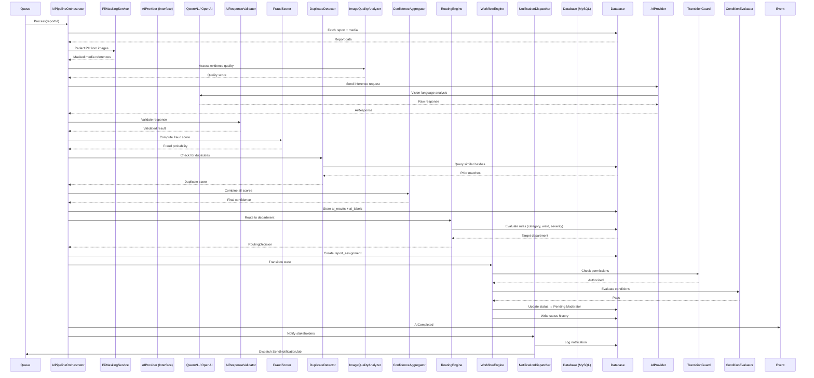

# AI Processing Flow

```mermaid
sequenceDiagram
    participant Queue
    participant AIPipelineOrchestrator
    participant PiiMaskingService
    participant AIProvider (Interface)
    participant QwenVL / OpenAI
    participant AiResponseValidator
    participant FraudScorer
    participant DuplicateDetector
    participant ImageQualityAnalyzer
    participant ConfidenceAggregator
    participant RoutingEngine
    participant WorkflowEngine
    participant NotificationDispatcher
    participant Database (MySQL)

    Queue->>AIPipelineOrchestrator: Process(reportId)
    AIPipelineOrchestrator->>Database: Fetch report + media
    Database-->>AIPipelineOrchestrator: Report data

    AIPipelineOrchestrator->>PiiMaskingService: Redact PII from images
    PiiMaskingService-->>AIPipelineOrchestrator: Masked media references

    AIPipelineOrchestrator->>ImageQualityAnalyzer: Assess evidence quality
    ImageQualityAnalyzer-->>AIPipelineOrchestrator: Quality score

    AIPipelineOrchestrator->>AIProvider: Send inference request
    AIProvider->>QwenVL / OpenAI: Vision-language analysis
    QwenVL / OpenAI-->>AIProvider: Raw response
    AIProvider-->>AIPipelineOrchestrator: AiResponse

    AIPipelineOrchestrator->>AiResponseValidator: Validate response
    AiResponseValidator-->>AIPipelineOrchestrator: Validated result

    AIPipelineOrchestrator->>FraudScorer: Compute fraud score
    FraudScorer-->>AIPipelineOrchestrator: Fraud probability

    AIPipelineOrchestrator->>DuplicateDetector: Check for duplicates
    DuplicateDetector->>Database: Query similar hashes
    Database-->>DuplicateDetector: Prior matches
    DuplicateDetector-->>AIPipelineOrchestrator: Duplicate score

    AIPipelineOrchestrator->>ConfidenceAggregator: Combine all scores
    ConfidenceAggregator-->>AIPipelineOrchestrator: Final confidence

    AIPipelineOrchestrator->>Database: Store ai_results + ai_labels
    AIPipelineOrchestrator->>RoutingEngine: Route to department
    RoutingEngine->>Database: Evaluate rules (category, ward, severity)
    Database-->>RoutingEngine: Target department
    RoutingEngine-->>AIPipelineOrchestrator: RoutingDecision

    AIPipelineOrchestrator->>Database: Create report_assignment
    AIPipelineOrchestrator->>WorkflowEngine: Transition state
    WorkflowEngine->>TransitionGuard: Check permissions
    TransitionGuard-->>WorkflowEngine: Authorized
    WorkflowEngine->>ConditionEvaluator: Evaluate conditions
    ConditionEvaluator-->>WorkflowEngine: Pass
    WorkflowEngine->>Database: Update status → Pending Moderator
    WorkflowEngine->>Database: Write status history

    AIPipelineOrchestrator->>Event: AICompleted
    AIPipelineOrchestrator->>NotificationDispatcher: Notify stakeholders
    NotificationDispatcher->>Database: Log notification
    NotificationDispatcher->>Queue: Dispatch SendNotificationJob
```
