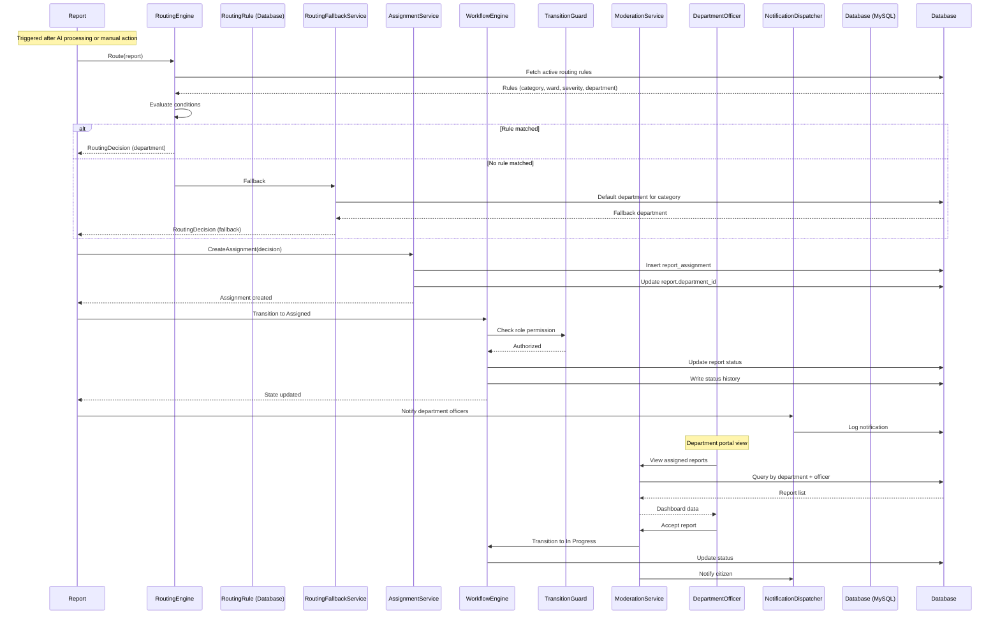

# Assignment Flow

```mermaid
sequenceDiagram
    participant Report
    participant RoutingEngine
    participant RoutingRule (Database)
    participant RoutingFallbackService
    participant AssignmentService
    participant WorkflowEngine
    participant TransitionGuard
    participant ModerationService
    participant DepartmentOfficer
    participant NotificationDispatcher
    participant Database (MySQL)

    Note over Report: Triggered after AI processing or manual action

    Report->>RoutingEngine: Route(report)
    RoutingEngine->>Database: Fetch active routing rules
    Database-->>RoutingEngine: Rules (category, ward, severity, department)

    RoutingEngine->>RoutingEngine: Evaluate conditions
    alt Rule matched
        RoutingEngine-->>Report: RoutingDecision (department)
    else No rule matched
        RoutingEngine->>RoutingFallbackService: Fallback
        RoutingFallbackService->>Database: Default department for category
        Database-->>RoutingFallbackService: Fallback department
        RoutingFallbackService-->>Report: RoutingDecision (fallback)
    end

    Report->>AssignmentService: CreateAssignment(decision)
    AssignmentService->>Database: Insert report_assignment
    AssignmentService->>Database: Update report.department_id
    AssignmentService-->>Report: Assignment created

    Report->>WorkflowEngine: Transition to Assigned
    WorkflowEngine->>TransitionGuard: Check role permission
    TransitionGuard-->>WorkflowEngine: Authorized
    WorkflowEngine->>Database: Update report status
    WorkflowEngine->>Database: Write status history
    WorkflowEngine-->>Report: State updated

    Report->>NotificationDispatcher: Notify department officers
    NotificationDispatcher->>Database: Log notification

    Note over DepartmentOfficer: Department portal view
    DepartmentOfficer->>ModerationService: View assigned reports
    ModerationService->>Database: Query by department + officer
    Database-->>ModerationService: Report list
    ModerationService-->>DepartmentOfficer: Dashboard data

    DepartmentOfficer->>ModerationService: Accept report
    ModerationService->>WorkflowEngine: Transition to In Progress
    WorkflowEngine->>Database: Update status
    ModerationService->>NotificationDispatcher: Notify citizen
```
