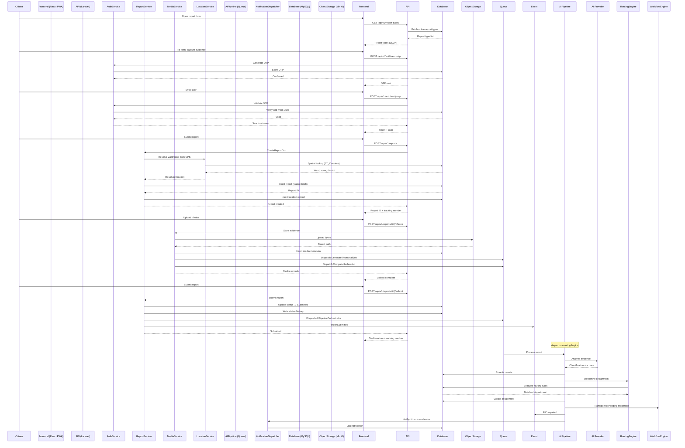

# Citizen Report Submission Flow

```mermaid
sequenceDiagram
    participant Citizen
    participant Frontend (React PWA)
    participant API (Laravel)
    participant AuthService
    participant ReportService
    participant MediaService
    participant LocationService
    participant AIPipeline (Queue)
    participant NotificationDispatcher
    participant Database (MySQL)
    participant ObjectStorage (MinIO)

    Citizen->>Frontend: Open report form
    Frontend->>API: GET /api/v1/report-types
    API->>Database: Fetch active report types
    Database-->>API: Report type list
    API-->>Frontend: Report types (JSON)

    Citizen->>Frontend: Fill form, capture evidence
    Frontend->>API: POST /api/v1/auth/send-otp
    API->>AuthService: Generate OTP
    AuthService->>Database: Store OTP
    Database-->>AuthService: Confirmed
    API-->>Frontend: OTP sent

    Citizen->>Frontend: Enter OTP
    Frontend->>API: POST /api/v1/auth/verify-otp
    API->>AuthService: Validate OTP
    AuthService->>Database: Verify and mark used
    Database-->>AuthService: Valid
    AuthService-->>API: Sanctum token
    API-->>Frontend: Token + user

    Citizen->>Frontend: Submit report
    Frontend->>API: POST /api/v1/reports
    API->>ReportService: CreateReportDto
    ReportService->>LocationService: Resolve ward/zone from GPS
    LocationService->>Database: Spatial lookup (ST_Contains)
    Database-->>LocationService: Ward, zone, district
    LocationService-->>ReportService: Resolved location
    ReportService->>Database: Insert report (status: Draft)
    Database-->>ReportService: Report ID
    ReportService->>Database: Insert location record
    ReportService-->>API: Report created
    API-->>Frontend: Report ID + tracking number

    Citizen->>Frontend: Upload photos
    Frontend->>API: POST /api/v1/reports/{id}/photos
    API->>MediaService: Store evidence
    MediaService->>ObjectStorage: Upload bytes
    ObjectStorage-->>MediaService: Stored path
    MediaService->>Database: Insert media metadata
    MediaService->>Queue: Dispatch GenerateThumbnailJob
    MediaService->>Queue: Dispatch ComputeHashesJob
    MediaService-->>API: Media records
    API-->>Frontend: Upload complete

    Citizen->>Frontend: Submit report
    Frontend->>API: POST /api/v1/reports/{id}/submit
    API->>ReportService: Submit report
    ReportService->>Database: Update status → Submitted
    ReportService->>Database: Write status history
    ReportService->>Queue: Dispatch AIPipelineOrchestrator
    ReportService->>Event: ReportSubmitted
    ReportService-->>API: Submitted
    API-->>Frontend: Confirmation + tracking number

    Note over AIPipeline: Async processing begins
    Queue->>AIPipeline: Process report
    AIPipeline->>AI Provider: Analyze evidence
    AI Provider-->>AIPipeline: Classification + scores
    AIPipeline->>Database: Store AI results
    AIPipeline->>RoutingEngine: Determine department
    RoutingEngine->>Database: Evaluate routing rules
    Database-->>RoutingEngine: Matched department
    AIPipeline->>Database: Create assignment
    AIPipeline->>WorkflowEngine: Transition to Pending Moderator
    AIPipeline->>Event: AICompleted
    AIPipeline->>NotificationDispatcher: Notify citizen + moderator
    NotificationDispatcher->>Database: Log notification
```
