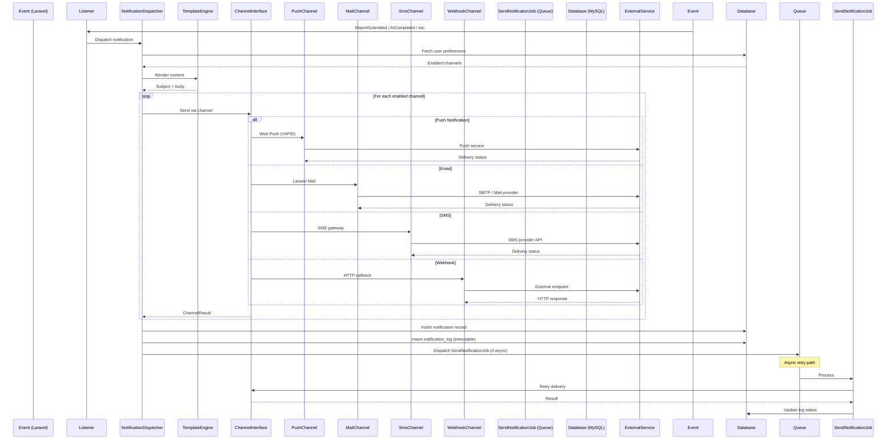

# Notification Delivery Flow

```mermaid
sequenceDiagram
    participant Event (Laravel)
    participant Listener
    participant NotificationDispatcher
    participant TemplateEngine
    participant ChannelInterface
    participant PushChannel
    participant MailChannel
    participant SmsChannel
    participant WebhookChannel
    participant SendNotificationJob (Queue)
    participant Database (MySQL)
    participant ExternalService

    Event->>Listener: ReportSubmitted / AICompleted / etc.
    Listener->>NotificationDispatcher: Dispatch notification
    NotificationDispatcher->>Database: Fetch user preferences
    Database-->>NotificationDispatcher: Enabled channels
    NotificationDispatcher->>TemplateEngine: Render content
    TemplateEngine-->>NotificationDispatcher: Subject + body

    loop For each enabled channel
        NotificationDispatcher->>ChannelInterface: Send via channel
        alt Push Notification
            ChannelInterface->>PushChannel: Web Push (VAPID)
            PushChannel->>ExternalService: Push service
            ExternalService-->>PushChannel: Delivery status
        else Email
            ChannelInterface->>MailChannel: Laravel Mail
            MailChannel->>ExternalService: SMTP / Mail provider
            ExternalService-->>MailChannel: Delivery status
        else SMS
            ChannelInterface->>SmsChannel: SMS gateway
            SmsChannel->>ExternalService: SMS provider API
            ExternalService-->>SmsChannel: Delivery status
        else Webhook
            ChannelInterface->>WebhookChannel: HTTP callback
            WebhookChannel->>ExternalService: External endpoint
            ExternalService-->>WebhookChannel: HTTP response
        end
        ChannelInterface-->>NotificationDispatcher: ChannelResult
    end

    NotificationDispatcher->>Database: Insert notification record
    NotificationDispatcher->>Database: Insert notification_log (immutable)
    NotificationDispatcher->>Queue: Dispatch SendNotificationJob (if async)

    Note over Queue: Async retry path
    Queue->>SendNotificationJob: Process
    SendNotificationJob->>ChannelInterface: Retry delivery
    ChannelInterface-->>SendNotificationJob: Result
    SendNotificationJob->>Database: Update log status
```
