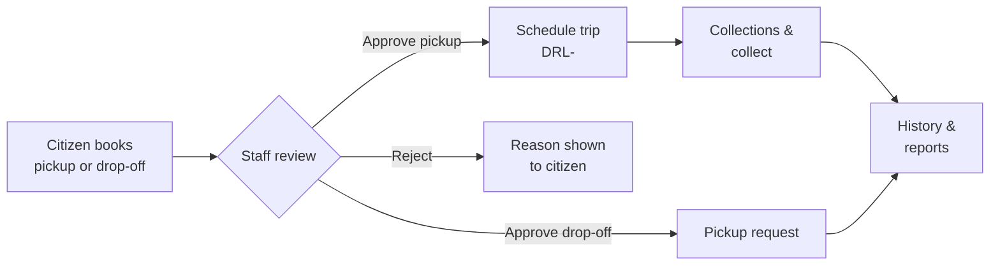

# Dr. Linen Textile Collection — User Guide

Welcome. This guide explains how the collection service works and how to use it day to day.

## The one rule

- **Home pickup needs at least 2 bags or 4 kg.** Either one is enough.
- **Centre drop-off accepts any amount.**
- Small home pickups waste a fuel trip, so the system blocks them and suggests drop-off.

## Booking and trip codes

- Every citizen booking gets a reference starting with **`DLN-`**. Keep it — it is how you track the request.
- Every driver trip gets a reference starting with **`DRL-`**. Staff use it to find the trip.

## Guide pages

### End-to-end flow

### Where is everything? (sidebar → page)

| Sidebar | Page |
|---|---|
| Collections (citizen) → New request | `/citizen/textile-collections/new` |
| Collections (citizen) → list / detail | `/citizen/textile-collections`, `/citizen/textile-collections/:id` |
| Reviews | `/operations/textile-collections/review` |
| Trips | `/operations/textile-collections/schedule` |
| Pickup request | `/operations/textile-collections/pickup-requests` |
| Collections | `/operations/textile-collections/collections` |
| History | `/operations/textile-collections/completed` |
| Reupload | `/operations/textile-collections/reuploads` |
| Server failures | `/operations/textile-collections/offline-recovery` |
| Capacity | `/operations/textile-collections/capacity` |

### Citizens

- [Requesting a home pickup](citizen-pickup.md)
- [Using centre drop-off](citizen-dropoff.md)
- [Tracking your request](tracking.md)

### Staff

- [Reviewing requests](staff-review.md)
- [Planning and scheduling trips](staff-scheduling.md)
- [Running collections and recording pickups](staff-dispatch.md)
- [Confirming pickup requests](staff-receipt.md)
- [Capacity rules and planning](phase-5-capacity.md)
- [Reports, exports, and history](phase-6-reporting.md)

### How it fits together

- [Phase 1 — Drop-off service](phase-1-dropoff.md)
- [Phase 2 — Driver trips](phase-2-trips.md)
- [Phase 3 — Rescheduling and reminders](phase-3-reschedule.md)
- [Phase 4 — Working with poor network](phase-4-offline.md)
- [Phase 5 — Pickup minimums and trip planning](phase-5-capacity.md)
- [Phase 6 — Reports and improvement](phase-6-reporting.md)
- [Quick answers](faq.md)
