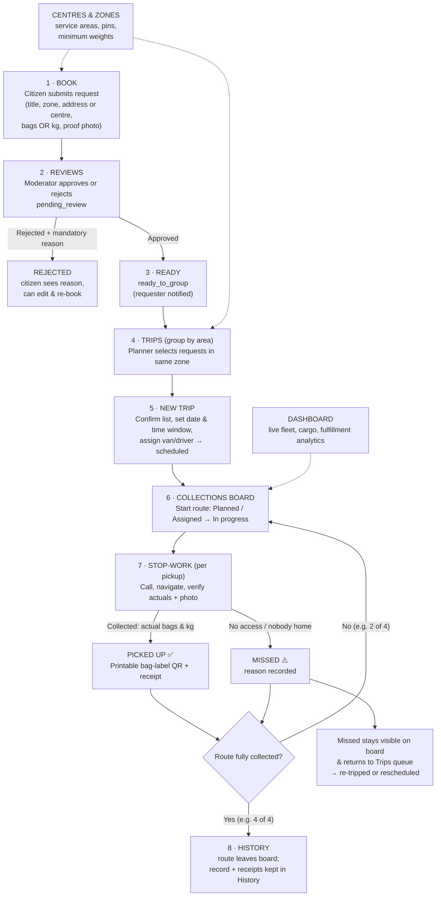

# Dr. Linen — End-to-End Collection Flow (Citizen → Completed)

*The complete journey of a used-clothes collection: booking, review, route
planning, field execution, receipts and history. First-read document before
the live demo.*

---

## 1. Actors & portals

| Who | Where | Does what |
|---|---|---|
| **Citizen** | Citizen portal (`/citizen/textile-collections/new`, `/:id`) + email | Books, tracks, reschedules/cancels, receives receipts |
| **Moderator** | Operations → **Reviews** (`/operations/textile-collections/review`) | Approves or rejects every new request (batch or individual) |
| **Route planner** | Operations → **Trips** (`/operations/textile-collections/schedule`) + **New trip** (`/schedule/new`) | Groups approved bookings by zone into routes, sets date & time window |
| **Dispatcher** | Operations → **Collections** (`/operations/textile-collections/collections`) | Assigns van + driver, starts routes, monitors live progress |
| **Driver / crew** | Stop-work page (`/operations/textile-collections/collections/:batchId/stops/:stopId`) | Navigates, calls citizen, weighs bags, records collected / missed |
| **Centre staff** | Operations → **Pickup request** (`/operations/textile-collections/pickup-requests`) | Scans booking QR or searches reference/phone, weighs, confirms drop-off |
| **Manager** | Operations → **Dashboard** (`/capacity`), **History** (`/completed`), **Centres** (`/centres`) | Live fleet position, volumes, fulfillment rate, audit trail, zones & centres |

Two **lanes**: **Home pickup** (crew visits the address) and **Centre
drop-off** (citizen brings bags to a centre). Home pickup is the main flow
below; drop-off differences are in §4.

---

## 2. Full flow diagram

---

## 3. Stage details

### Stage 1 — Book (citizen, ~2 minutes)

**Page:** Citizen portal → Request a collection (`/citizen/textile-collections/new`).

- **Short title** *(mandatory, min 5 chars)*, e.g. "2 bags of old clothes"
- **Material** — Clothes & Textiles (`clothes_waste`) *(auto-selected)*
- **Service zone** *(mandatory)* — auto-selected from the profile address or manually chosen
- **Collection method toggle**:
  - **"Pick up from location"** ("We come to your doorstep.")
  - **"Drop at center"** ("Drop off any amount — no minimum.")
- **Pickup address vs Drop-off centre**:
  - **For home pickup:** Pickup address *(mandatory, min 10 chars)* + optional GPS capture / map pin.
  - **For centre drop-off:** No home address is asked or required (#16). Citizen chooses an open drop-off centre in the zone.
- **Requester details**:
  - Requester type: **Individual** or **RWA / Community**
  - Name *(mandatory, min 2 chars)*, Email *(for receipt)*, Phone *(8–20 digits, for pickup updates)*
  - If RWA: Apartment / community name *(mandatory)*
- **How much do you have?**:
  - **"How many bags?"** (whole numbers 0–999) **or** **"About how many kg?"** (whole kg 0–99,999) per #14 *(at least one mandatory)*
- **Proof photo & Notes**:
  - Photo (optional, upload file or take with camera, up to 10 MB)
  - Gate & handover notes (optional, e.g. "Leave with building security")
- **Date & time scheduling notice:** The citizen booking form **does not** ask for a date or time slot. An availability notice indicates upcoming service availability; the actual collection date and time window are scheduled by Operations in Stage 4.

**Guardrails the citizen sees:**
Home pickup enforces the service zone's **minimum weight** (e.g. 4 kg). If the estimate is below minimum (or only bags are entered without meeting the weight threshold), an amber notice warns:
> *"Below the pickup minimum — Home pickup needs at least X kg to dispatch a vehicle. Add more weight, or switch to centre drop-off (any amount accepted)."*

A 1-tap link immediately switches the method to **"Drop at center"**.

**Result:** Booking reference (e.g. `DLN-2026-6A105FEE`) + **booking pass with QR code**, status **`pending_review`**. Confirmation by email/SMS.

---

### Stage 2 — Reviews (moderator)

**Page:** Operations → **Reviews** (`/operations/textile-collections/review`), titled "Pickup reviews" with a live `[X] waiting` badge.

- Filter by search query, service zone, collection method, or category.
- **Batch decision:** Check multiple rows to see totals (`X selected · Y bags · Z kg`) and click **"Approve [X] requests"** with a confirmation dialog.
- **Individual decision:** Click any row to open the full request detail page (`/operations/textile-collections/:id`) with citizen contact, address, map location, evidence photo, and notes.
- **Approve:**
  - Home pickup transitions to **`ready_to_group`** (citizen receives notification of acceptance).
  - Centre drop-off transitions to **`dropoff_awaiting_drop`** with validity dates (`dropoff_valid_from` to `dropoff_valid_until`).
- **Reject:** Compulsory rejection reason is recorded (`rejection_reason`) and displayed in the citizen's portal. Status becomes **`rejected`**.

---

### Stage 3 — Trips: group by area (planner)

**Page:** Operations → **Trips** (`/operations/textile-collections/schedule`), titled "Trip scheduling" with counter badge `[X] to schedule`.

- Shows all approved (`ready_to_group`) **and missed** requests, grouped accordion-style by zone/area.
- Unavailable date badges and reschedule details surface why previous slots were missed or modified.
- **Zone constraint rule:** All selected requests must belong to the **same service zone** (`selectedZoneIds.size === 1`). If requests across different zones are checked, a red warning alert appears:
  > *"Requests from multiple zones selected — deselect until one zone remains."*
- **Floating action dock:** Checking requests summons a persistent bottom action dock:
  `[X] selected · [Y] bags · Schedule →` and a "Clear selection" button.
- Clicking Schedule navigates to `/operations/textile-collections/schedule/new`, passing the selection state.

---

### Stage 4 — New trip: fix date & time (planner)

**Page:** Operations → **New trip** (`/operations/textile-collections/schedule/new`).

- **Date selection:** Quick shortcut buttons (**"Today"**, **"Tomorrow"**) or custom calendar date picker.
- **Time window:** Preset chips (**`09:00–12:00`**, **`12:00–15:00`**, **`15:00–18:00`**) or custom start/end times.
- **Vehicle & Crew assignment:**
  - Driver name, Team / crew name, Vehicle registration / label.
  - Optional custom trip reference (auto-generated e.g. `DRL-260826-XX11TO` if omitted), Dispatch instructions.
- **Route optimization & Manifest:**
  - Manifest displays citizen names, addresses, and estimated volume per stop.
  - Manual stop reordering (Move Up / Move Down buttons).
  - 1-tap proximity suggestion (`suggestProximityOrder`): a hint proposes visiting the nearest collection first, then the next-nearest, using saved map pins — Apply, then confirm the order.
  - Ability to remove stops from the batch.
- **Capacity guardrail:** Validates against zone vehicle rules (weight, bags, stop limits) with warning/blocker banners.
- **Reschedule freeze check:** If any stop is currently in an active route, an override reason (min 5 chars) is compulsory.
- **Result:** Clicking **"Schedule trip"** creates the batch (`planned` or `assigned`), marks all included requests as **`scheduled`**, and redirects to the Collections board.

---

### Stage 5 — Collections board: dispatch (dispatcher)

**Page:** Operations → **Collections** (`/operations/textile-collections/collections`), titled "Collections" ("Fleet dispatch, active route execution, and pickup progress").

- **4-Stat Metric Summary:** Active Vans (online count), Route Progress (% and `X of Y completed`), Recovery Cargo (total kg + estimated bags), Remaining Pickups.
- **Status Filter Tabs:** **All Routes ([X])** / **In Progress ([Y])** / **Planned ([Z])** with live counters.
- **Route search & filters:** Filter routes by reference, driver, vehicle label, or customer address, plus date (Today / Tomorrow / All) and zone filters.
- **Operations table:**
  - Route Reference, Date, Status (`Planned`, `Assigned`, `In progress`), Driver / Vehicle, Pickups & Cargo, and live Progress bar (`x of y collected`).
  - Interactive route map drawer with stop markers.
  - **Next Pickup** button linking straight to the next pending stop on the route.
- **Route actions:** Edit driver/vehicle assignment, or click **"Start"** to transition the batch from `planned`/`assigned` → **`in_progress`**.
- **Visibility rule:** A route leaves the board only when **every** pickup is collected (`isTripFullyExecuted`: all stops `picked_up`). Partials (`2 of 4`) and routes containing **missed** stops remain on the board until rescheduled or resolved.

---

### Stage 6 — Stop-work: the doorstep (crew)

**Page:** Collections → Next Pickup → stop-work page (`/operations/textile-collections/collections/:batchId/stops/:stopId`).

- **Stop header & info:**
  - Stop sequence index (`#1`, `#2`, etc.) and route progress bar.
  - Citizen name, requester type (Individual vs RWA), reference with 1-tap "Copy" button.
  - Quick contact bar: Tap-to-call (`tel:`), Tap-to-navigate (Google Maps directions).
  - Stop route map showing current stop pin and sibling stops on the route.
  - Citizen handover instructions (gate codes, landmarks) & Citizen evidence photo from booking.
- **Record Collection Form (`StopRecordForm`):**
  - **Actual bags** (integer, min 1) and **Actual weight (kg)** (min 0.1).
  - **Proof photo (mandatory):** Live camera capture (`CameraCapture`) or file chooser.
  - **Variance check:** If actual differs from estimate by >= 25% or bag count changes, **"Remarks *"** becomes mandatory (placeholder: *"Brief remark — e.g. half a kg more than estimated"*).
  - Click **"Confirm"** (green button).
- **Success state & Printable Bag Label (`ReceiptCard`):**
  - Displays **"[Citizen Name] collected"** header with green checkmark.
  - Shows verified actuals (`X bags · Y kg`).
  - Renders the printable **Bag label · receipt QR** card (`ReceiptCard`): citizen name, DLN- reference, actual bags & kg, collection timestamp, route reference, and QR code for offline warehouse scans.
  - **"Print bag label"** button triggers browser print formatted specifically for label stickers.
  - Navigation button: **"Proceed to next collection ([Next Name]) →"** or **"Return to Collections"**.
- **Alternative action — Mark missed:**
  - Mandatory reason required (e.g. "gate locked, nobody at home", "unreachable") → status becomes **`missed`**.
  - Logged, citizen notified, route remains on Collections board, and pickup returns to Trips queue for re-attempt.
- **Offline operation:** If connection drops, stop outcomes and photos queue locally via IndexedDB (`textileOfflineQueue`). Auto-drains when reconnected. Operations → **Reupload** (`/reuploads`) and **Server failures** (`/offline-recovery`) allow manual queue inspection and retries.

---

### Stage 7 — Finish the route

When the last stop is collected (`4 of 4`), the route shows **Complete**, **leaves the Collections board**, and moves to **Pickup history** with totals (`4 pickups · 16 kg (4 bags)`) and full audit trail.

---

### Stage 8 — History, receipts & proof (everyone)

- **Pickup history** (Operations → **History**, `/operations/textile-collections/completed`): Filter by All, Collected (`picked_up`), Drop-off received (`received_at_centre`), Missed (`missed`), Rejected (`rejected`), and Cancelled (`cancelled`).
- **Receipts:**
  - Citizen receives receipt by email and in-portal (`/citizen/textile-collections/:id`).
  - Receipt QR opens a public verification page.
  - **Bag-label QRs** physically attached to collection bags match the receipt — unbroken custody chain from doorstep to processing facility.
- **Reschedule:** Citizen or staff can reschedule a missed or pending pickup back to **`ready_to_group`** to be assigned to a new trip. Rescheduling is frozen once a trip has started unless an override reason is provided (audit-logged).
- **Cancel:** Citizen can cancel with reason from their portal → **`cancelled`**, immediately leaving all active queues.

---

## 4. Drop-off lane (differences only)

1. **Citizen booking:** Citizen selects **"Drop at center"** on the booking form. No home address is asked or required (#16). Citizen selects an active drop-off centre in their zone.
2. **Approval:** Moderator approves on Operations → **Reviews**. Status becomes **`dropoff_awaiting_drop`** with validity dates (`dropoff_valid_from` to `dropoff_valid_until`). Citizen receives a drop-off booking pass with a QR code in their portal.
3. **Arrival at centre:** Citizen brings bags to the centre. Centre staff open Operations → **Pickup request** (`/operations/textile-collections/pickup-requests`).
   - Staff can search by reference (`DLN-...`) or phone number, OR click **"Scan booking QR with camera"** to scan the citizen's booking pass instantly using their camera.
   - Exact booking loads with requester name, phone, and zone.
   - Staff enters verified **actual bags**, **actual weight (kg)**, captures a **proof photo**, adds remarks if variance >= 25%, and clicks **"Confirm pickup request"** → status becomes **`received_at_centre`**.
   - Generates the printable **Bag label · receipt QR** card (`ReceiptCard`) with a **"Print bag label"** button to stick on the bag.
   - **"Find next booking"** button resets the form for the next citizen.
4. **Offline / Warehouse bag verification:** On the same Pickup request page, staff can use the **"Verify a tagged bag"** scanner (`VerifyBagCard`) to scan any bag label QR with their camera. Decodes reference, citizen name, bags, kg, and trip/centre origin offline, and resolves the live database record when online.
5. **No van, no route, no collections board:** Drops straight into **History** upon confirmation.

---

## 5. Setup & oversight (manager)

- **Centres & Service zones** (Operations → **Centres**, `/operations/textile-collections/centres`): Manage service area boundaries, drop-off centre locations/pins, operating hours, phone numbers, and per-zone **pickup minimums** (`min_weight_kg`).
- **Operations dashboard** (Operations → **Dashboard**, `/operations/textile-collections/capacity`):
  - Live field position strip: Active routes, active vans, remaining pickups, live recovery cargo (kg + bags).
  - Period performance analytics with Year, Month, and Zone filters.
  - Key metrics: Total requests, Collected bags, Weight collected (kg), Fulfillment rate (%), Reschedule rate (%), Total trips, Average bag density (kg/bag), Pickup density (requests/trip).
  - Volume trend charts and zone recovery comparisons. (Strictly linen & used-clothes; no unrelated waste categories).
  - One-click **"Export CSV"** for reporting.
- **Reminders:** Automatic pickup-day notifications; suppressed once collected, missed, cancelled, or rejected.

---

## 6. Status cheat-sheet

- **Request lifecycle:**
  `pending_review` → `ready_to_group` (home pickup) / `dropoff_awaiting_drop` (centre drop-off) → `scheduled` → `picked_up` / `received_at_centre`.
  *Side paths:* `missed`, `rejected`, `cancelled`.
- **Trip / Route lifecycle:**
  `planned` → `assigned` → `in_progress` → `completed` (or `cancelled`).

---

## 7. Suggested demo order (live demo)

1. **Book a home pickup** as a citizen (`/citizen/textile-collections/new`).
   - Demonstrate method toggle ("Pick up from location" vs "Drop at center").
   - Enter title, name, phone, pickup address.
   - Demonstrate the minimum weight guardrail (e.g. entering 2 kg shows amber alert with 1-tap switch to drop-off). Enter 3 bags / 8 kg. Submit and show booking reference + pass QR.
2. **Reviews → approve** as moderator (`/operations/textile-collections/review`).
   - Show `[X] waiting` counter, filter by zone.
   - Approve request → transitions to `ready_to_group`.
3. **Trips → select** as planner (`/operations/textile-collections/schedule`).
   - Show grouping by zone. Show single-zone selection constraint.
   - Select requests → floating action dock appears (`X selected · Y bags · Schedule →`).
4. **New trip → configure & schedule** (`/operations/textile-collections/schedule/new`).
   - Select date ("Today" or "Tomorrow") and time window preset (`09:00–12:00`).
   - Assign driver and vehicle registration.
   - Apply the proximity suggestion to arrange stops, then click "Schedule trip".
5. **Collections board → dispatch** (`/operations/textile-collections/collections`).
   - Show 4-stat metric summary (Active Vans, Route Progress, Recovery Cargo, Remaining Pickups).
   - Review route in table, click "Start" route → transitions to `in_progress`. Click **"Next Pickup"**.
6. **Stop-work → doorstep execution** (`/operations/textile-collections/collections/:batchId/stops/:stopId`).
   - Show stop sequence (`#1`), citizen contact (tap-to-call), address (tap-to-navigate), citizen evidence photo and notes.
   - Enter actual bags (e.g. 3) and actual weight (e.g. 8.5 kg). Capture proof photo with live camera.
   - Demonstrate variance remarks requirement if quantity differs by >= 25%.
   - Click "Confirm" → status becomes `picked_up`.
7. **Success & Printable Bag Label:**
   - Show prominent "[Citizen Name] collected" header and verified actuals.
   - Display printable **Bag label · receipt QR** card (`ReceiptCard`).
   - Click **"Print bag label"** to show label print sheet.
   - Click **"Proceed to next collection"**.
8. **Record a missed stop:**
   - On the next stop, click **"Mark missed"**, select/enter reason (e.g. "Gate locked, nobody home").
   - Show that route remains on Collections board (not complete) and missed stop returns to Trips queue.
9. **Complete the route:**
   - Complete remaining stops → route reaches 100% (`isTripFullyExecuted`), leaves Collections board, and moves to **History** (`/operations/textile-collections/completed`).
10. **Drop-off lane:**
    - Book a drop-off request ("Drop at center", no personal address required).
    - Approve in Reviews → status becomes `dropoff_awaiting_drop`.
    - Open Operations → **Pickup request** (`/operations/textile-collections/pickup-requests`).
    - Use **"Scan booking QR with camera"** to scan citizen's pass.
    - Weigh, take proof photo, click "Confirm pickup request" → status becomes `received_at_centre`. Print bag label.
11. **Scan & verify tagged bag:**
    - On the Pickup request desk, use the **"Verify a tagged bag"** camera scanner to scan the printed bag receipt QR, demonstrating offline verification of bag custody.
12. **Citizen portal & reschedule:**
    - Show citizen viewing collection receipt, actuals, and QR verification in `/citizen/textile-collections/:id`.
    - Show rescheduling a missed pickup back to `ready_to_group`.
13. **Dashboard & Analytics:**
    - Open Operations → **Dashboard** (`/operations/textile-collections/capacity`).
    - Show live fleet position, recovery cargo volume, fulfillment rate, average bag density, and CSV export.
