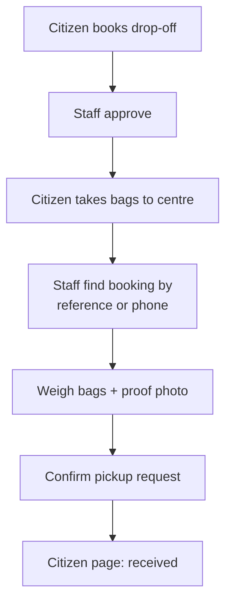

# Phase 1 — Drop-off service

> **Citizens:** sidebar **Collections → New request**, choose “I’ll go to the centre.”
> **Staff:** sidebar **Pickup request** (`/operations/textile-collections/pickup-requests`).

**What it is:** citizens bring bags to a Dr. Linen collection centre instead of waiting for a truck.

## How it works

1. The citizen chooses **“I’ll go to the centre”** while booking.
2. The page shows the exact centre name, address, operating hours, accepted materials, the booking reference, and an **Open in Maps** action.
3. Staff approve the booking, which confirms the drop-off window.
4. The citizen brings the bags; counter staff record the actual quantity with a proof photo.
5. The citizen’s page updates to **received**.

## Flow

## Rules

- Any amount is accepted — no minimum, no exception process.
- A drop-off booking can never be added to a driver trip.
- A receipt needs the configured proof photo and quantity; every receipt is audit-logged with staff and timestamp.

## Who does what

| Citizen | Staff |
|---|---|
| Books, brings bags to the centre | Approves, weighs, photographs, confirms pickup request |
