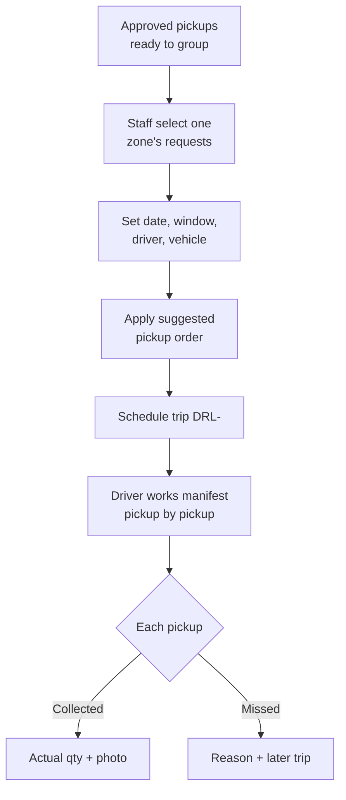

# Phase 2 — Driver trips

> **Staff:** sidebar **Trips** to schedule (`/operations/textile-collections/schedule`),
> sidebar **Collections** to run the trip (`/operations/textile-collections/collections`).
> **Citizens:** sidebar **Collections** to track the booking.

**What it is:** approved home pickups grouped into executable driver trips.

## How it works

1. Approved pickups wait in the scheduling pool as *ready to group*.
2. Staff select one zone’s requests, set a date and window, assign a driver or team and vehicle, and schedule the trip (`DRL-` reference).
3. The driver opens the mobile-friendly manifest: next pickup, address, maps link, call action, estimates, instructions, and citizen photo.
4. Each pickup is recorded **collected** (actual bags, kg, proof photo) or **missed** (reason).
5. Citizens see their confirmed date and window, then the final outcome.

## Flow

## Rules

- Trips show progress: unstarted, in progress, completed.
- An assigned worker sees only their own authorised trips.
- Recording a pickup cannot overwrite a colleague’s later outcome.
- A missed pickup keeps a rescheduling path and a citizen-visible explanation.
- Staff private phone numbers are never exposed; contact goes through the approved call action.
