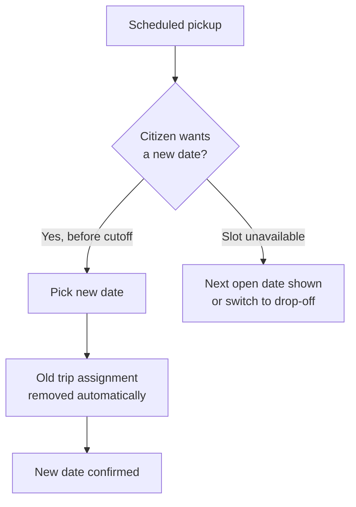

# Phase 3 — Rescheduling and reminders

> **Citizens:** open the booking from sidebar **Collections** and choose a new date.

**What it is:** citizens manage their own pickup changes without calling support.

## What citizens can do

- **Reschedule** an eligible doorstep pickup before the cutoff shown on the request page.
- See **unavailable dates** up front instead of booking a slot that cannot be served.
- Update readiness and contact instructions without touching protected history or evidence.
- Get **reminders** before the trip date on the approved channels.

## Flow

## Rules

- Rescheduling removes the old trip assignment atomically — no duplicate active bookings.
- Old and new schedules stay visible in the audit and history record.
- Reminders are never sent for cancelled, rejected, or already-completed requests.
- Rescheduling freezes once field execution starts, except for an authorised partner override with a recorded reason.
- If a slot becomes unavailable, the page shows the next open date or suggests drop-off.
