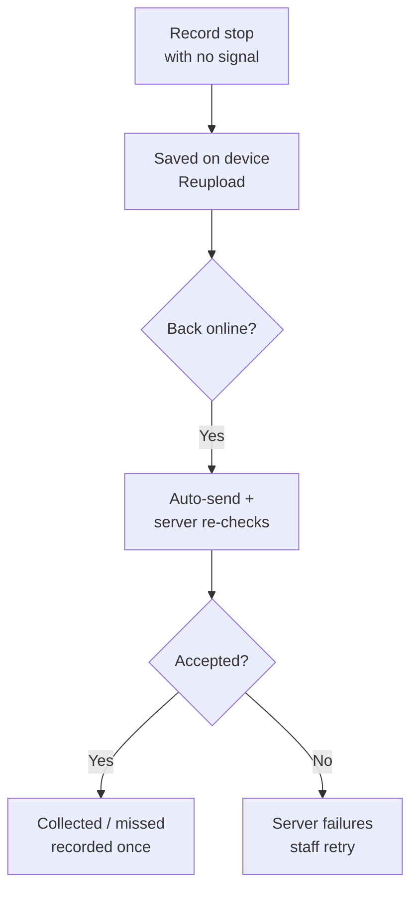

# Phase 4 — Working with poor network

> **Where to find it:** sidebar **Reupload** (pending items,
> `/operations/textile-collections/reuploads`) and **Server failures**
> (permanent failures, `/operations/textile-collections/offline-recovery`)

**What it is:** field staff can finish a legitimate stop with no signal and sync later.

## How it works

1. With no network, record the outcome, quantities, and proof photo as normal.
2. The item is stored on the device and shown in **Reupload** as pending.
3. When connectivity returns, it sends automatically (background sync) or on manual retry.
4. The server re-checks everything — validation, authorisation, photo checksum, audit — exactly as if it arrived live.
5. Items that permanently fail move to **Server failures**, where authorised staff can inspect and retry.

## Flow

## Rules

- Queued items stay tied to the signed-in user and session.
- Retry uses idempotency keys: one tap, one outcome — never duplicates.
- Logging out, session expiry, or a device change has defined safe behaviour; nothing is silently discarded.
- Offline mode never bypasses server checks.
