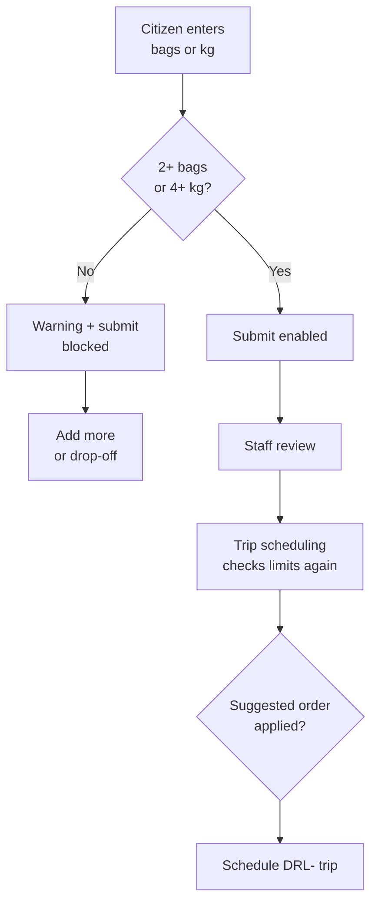

# Phase 5 — Pickup minimums and trip planning

> **Where to find it:** sidebar **Capacity** for the rules
> (`/operations/textile-collections/capacity`); sidebar **Trips** for planning
> (`/operations/textile-collections/schedule`)

**What it is:** keeps routes economical while keeping every decision explainable and human-owned.

## The minimum policy

- Home pickup needs **at least 2 bags or 4 kg** in every zone (Kengeri, Jayanagar, Whitefield).
- The policy is partner-owned configuration — changeable without a code update — and every request keeps the decision context from when it was reviewed.
- There is **no exception or override path**: below-minimum home pickups are blocked at request, approval, and scheduling. Citizens use drop-off instead.

## Flow

## What citizens see

- The form shows the zone minimum and checks each keystroke.
- Below the minimum: an amber warning names the shortfall and the submit button reads **Pickup minimum not met**.
- Meeting either bags or weight clears the warning immediately.

## What staff see

- The **Capacity** page lists each zone’s minimum, vehicle limits, and guidance text.
- On the **Schedule** desk, selecting stops shows total bags and kg against limits:
  - Over a vehicle limit → red blocker naming the fix (remove stops, split the trip).
  - Near a limit → amber advisory.
  - Below the minimum → blocked.
- With 2 or more stops, a **suggested stop order** (shortest route first) can be applied to the manifest before confirming.
- The system suggests; staff decide. No trip is ever auto-approved.
