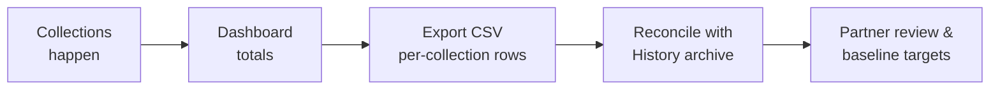

# Phase 6 — Reports and improvement

> **Where to find it:** sidebar **Capacity** for the dashboard and Export CSV
> (`/operations/textile-collections/capacity`); sidebar **History** for the archive
> (`/operations/textile-collections/completed`)

**What it is:** partner visibility into service quality and economics.

## Flow

## Dashboard (Capacity page)

- **Requests** — total bookings in the period.
- **Collected bags** — actual bags recorded, with the citizen estimate alongside.
- **Missed rate** — share of missed pickups, with the count.
- **Reschedule rate** — share rescheduled, with the count.
- **Data-quality notice** — warns when requests lack estimates or volume is too thin for targets.
- **Metric definitions** — every KPI named with its exact meaning and source.
- Staff only ever see their own partner’s data.

## CSV export

- **Export CSV** downloads one row per collection: reference (`DLN-`), category, method (premises vs drop-off), estimated and actual bags and kg, service zone, status, scheduled date, and created/completed timestamps.
- Row totals reconcile exactly with the dashboard.
- Use it for partner reconciliation and month-end reviews.

## History archive

- **History** lists completed, missed, rejected, and cancelled requests with references, zones, estimated vs actual quantities, and statuses.
- Drop-off centre receipts and doorstep pickups are reported separately.
- Targets are set only after a baseline period — never before the data exists.
